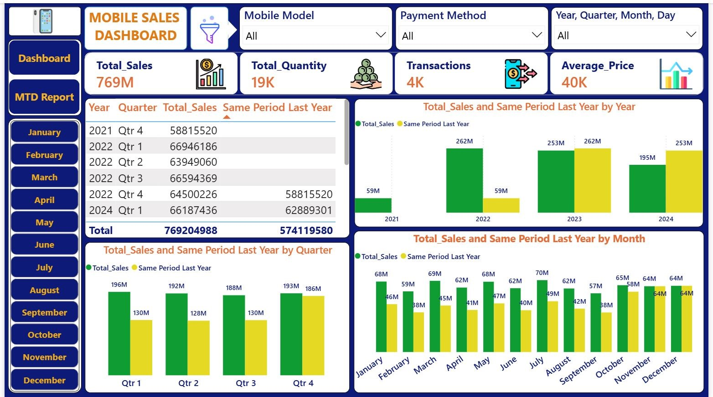

# Mobile Sales Dashboard - Power BI Project
## Project Overview
This project is a Power BI dashboard created to analyze mobile sales performance.  
The dashboard provides insights into total sales, total quantity, transactions, average price, city-wise sales, monthly trends, customer ratings, mobile model performance, payment methods, and brand-wise performance.
## Dashboard Features
- Total Sales KPI
- Total Quantity KPI
- Total Transactions KPI
- Average Price KPI
- Sales by City using Map
- Quantity by Month trend
- Sales by Day Name
- Customer Rating Analysis
- Sales by Mobile Model
- Transactions by Payment Method
- Brand-wise Sales and Quantity Table
- Interactive filters for Brand, Mobile Model, Payment Method, and Month
## Tools Used
- Microsoft Power BI
- Power Query
- DAX
- Data Cleaning
- Data Modeling
- Data Visualization
## Dashboard Preview

## Project Objective
The main objective of this dashboard is to analyze mobile sales data and convert raw data into meaningful business insights.  
It helps understand sales trends, customer preferences, payment behavior, and product performance.
## Key Learnings
- Data importing and cleaning
- Creating relationships between tables
- Building KPIs using DAX
- Designing interactive visuals
- Creating slicers and filters
- Dashboard formatting and layout design
## Author
   Swetabh Suman
